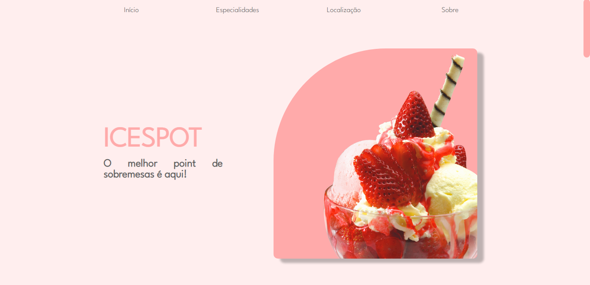
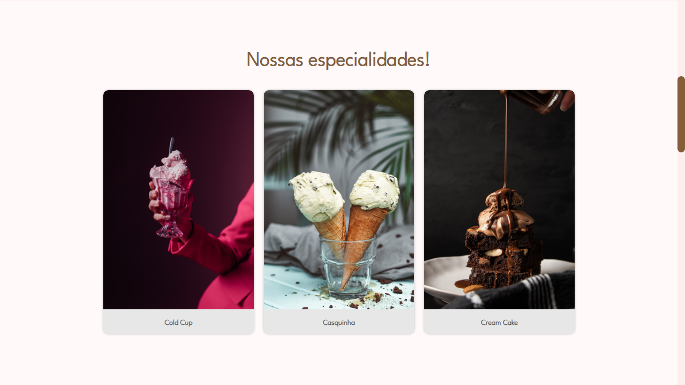
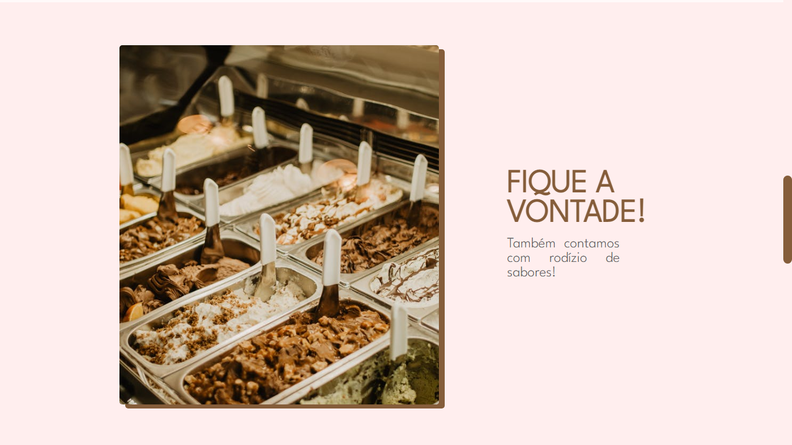
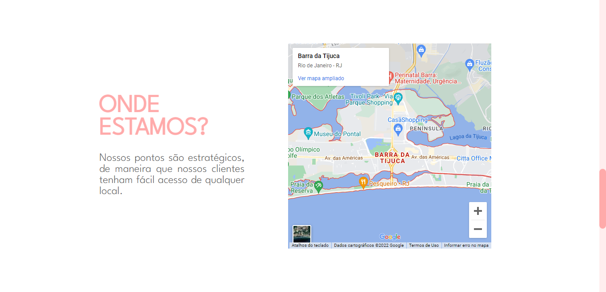
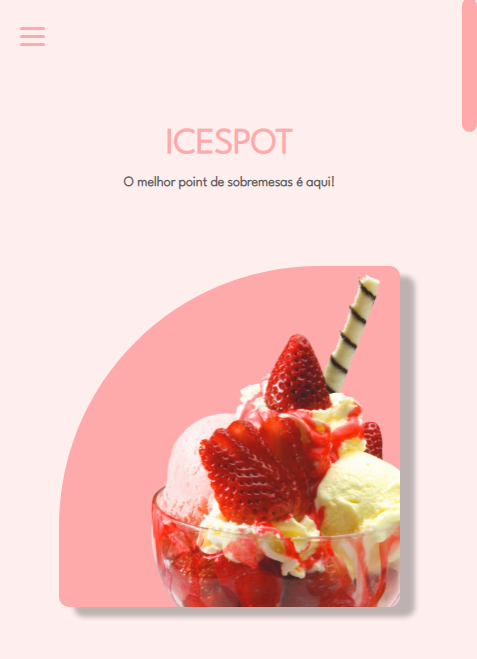

# 🍨 IceSpot
Projeto de Landing Page de uma sorveteria fictícia, com intuito de apresentar as especialidades do local, sua localização e seus meios de contato.

Tecnologias utilizadas:
 - HTML
 - CSS
 - Javascript
 - SASS

##  🔸 Screenshots

▫️ Desktop  
 
 
 
 
 
 
 
 
▫️ Mobile  

## 🔸 Confira o projeto:
https://danideoliveira.github.io/iceCreamPage/

